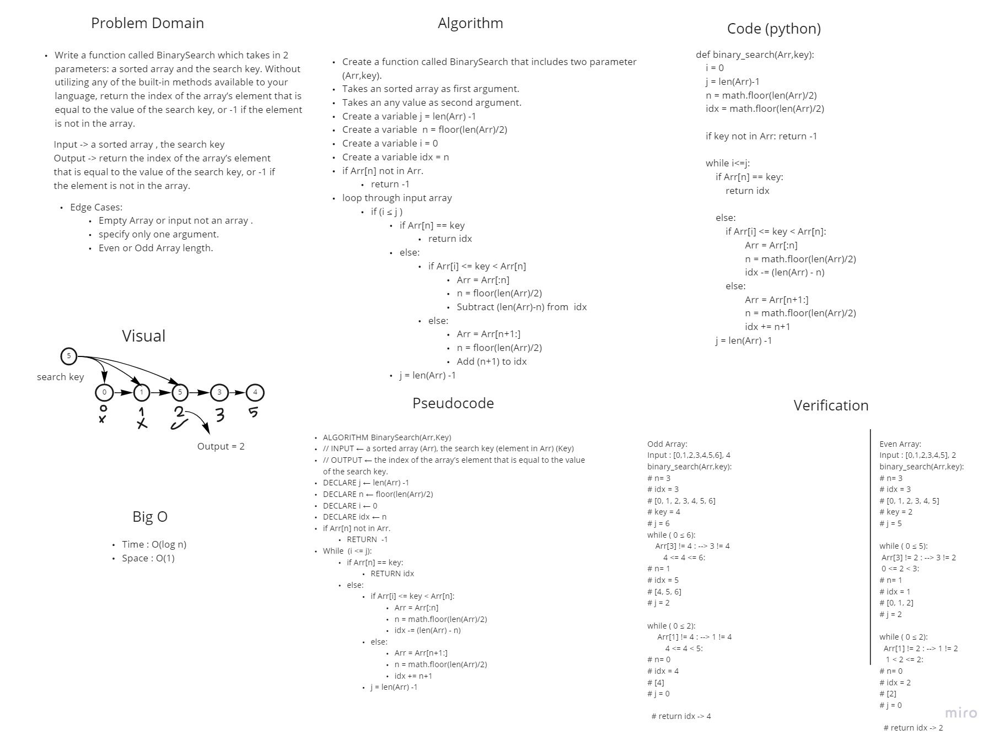

# Binary Search of Sorted Array
Write a function called BinarySearch which takes in 2 parameters: a sorted array and the search key. Without utilizing any of the built-in methods available to your language, return the index of the array’s element that is equal to the value of the search key, or -1 if the element is not in the array.

Input -> a sorted array , the search key
Output -> return the index of the array’s element that is equal to the value of the search key, or -1 if the element is not in the array.

| Input      | Output |
| ----------- | ----------- |
| [4, 8, 15, 16, 23, 42], 15      | 2       |
| [-131, -82, 0, 27, 42, 68, 179], 42   | 4        |
| [11, 22, 33, 44, 55, 66, 77], 90      | -1       |
| [1, 2, 3, 5, 6, 7], 4   | -1        |

## Whiteboard Process

## Approach & Efficiency
What approach did you take?
- Binary Search

Discuss Why?
- it takes less time(less steps) than normal iteration
What is the Big O space/time for this approach?
Time : O(log n)
Space : O(1)