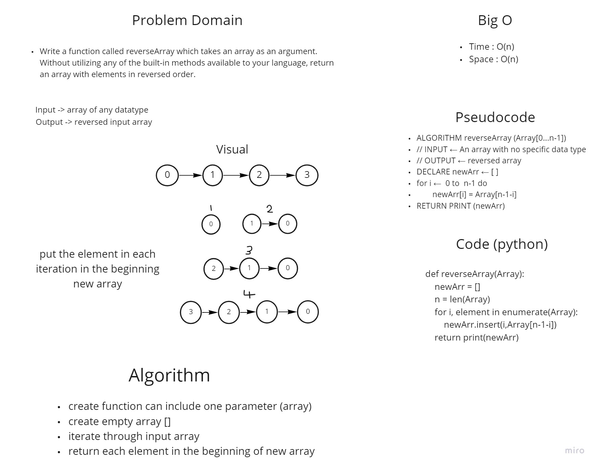

# Reverse an Array
- The function has a paramater and this paramter should be an array.
- for example we have this array : [0,1,2,3], we have to push the first element to the last index which give us this result Output : [3,2,1,0].

## Whiteboard Process

