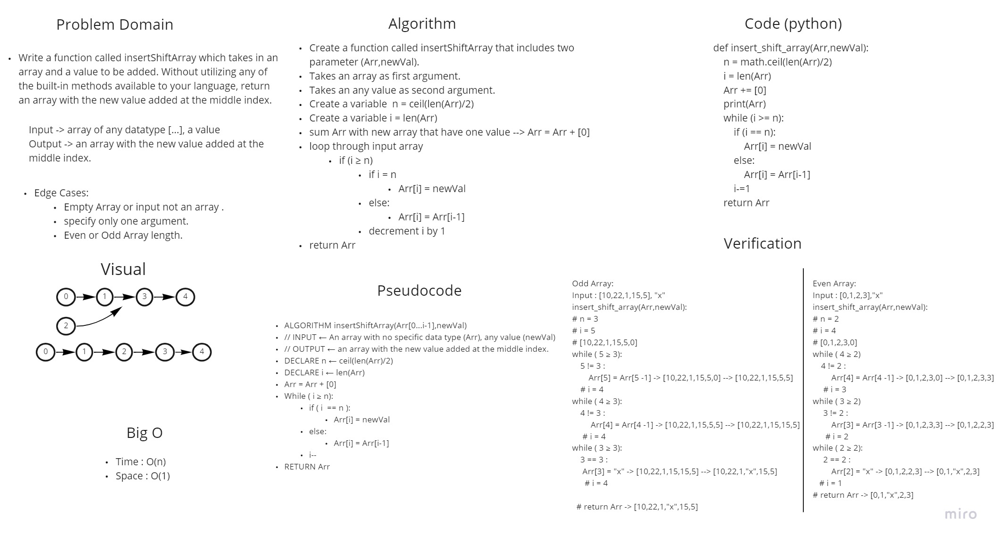

# Insert to Middle of an Array
- Write a function called insertShiftArray which takes in an array and a value to be added. Without utilizing any of the built-in methods available to your language, return an array with the new value added at the middle index.
- Input -> array of any datatype [...], a value --> [0,1,2,3], "x"
- Output -> an array with the new value added at the middle index. --> [0,1,"x",2,3]

## Whiteboard Process

## Approach & Efficiency
- What approach did you take?
    - Add new array that includes one value to the main array to be able to add new value in the middle of array.
        - [0,1,2,3]+[0]->[0,1,2,3,0]
    - shift second half of array to the end.
        - [0,1,2,3,0]->[0,1,2,2,3]
    - replace the new value with the value of the middle index.
        - [0,1,2,2,3]->[0,1,"x",2,3]

- Why?
    - We don't have to create a new Array.
    - loop works only on the second half of array.

- What is the Big O space/time for this approach?
    - Space : O(1)
    - Time : O(n)

## Stretch Goal

    def deleteElementArr(Arr):
        Middle = math.floor(len(Arr)/2)
        n = len(Arr)
        return [Arr[i] for i in range(n) if i != Middle]